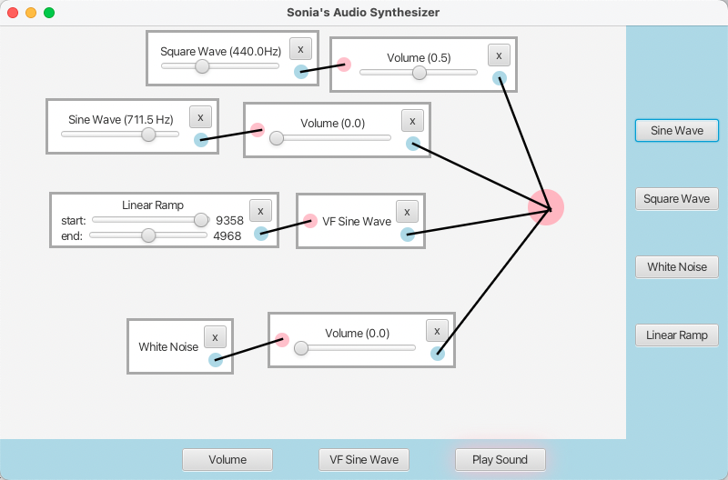
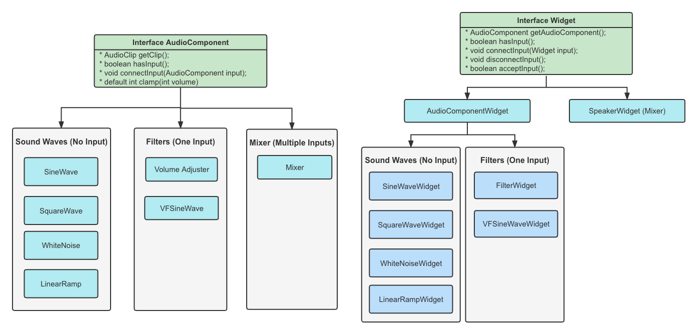

# Audio Synthesizer

## Introduction

This is a software audio synthesizer implemented in Java. It can generate different sound waves: sine, square, white noise, and linear ramp. And itt also supports different filters, including volume adjuster, VF sine wave, and mixer (play button). The GUI is implemented in JavaFX, which allows users can create, drag, connect, and remove widgets easily. 

Learn more from this [video introduction]().

## Project Structure

## Credits

This is my course project for the course CS6011 at [MSD](https://msd.utah.edu/?gclid=CjwKCAiAmuKbBhA2EiwAxQnt75vBtdNGBe7s0Bw--3lTKtnSo7SIWoJFL_pShCbyO1GSJZbeqGL_exoCaG8QAvD_BwE) program. Thanks [Dave](http://www.cs.utah.edu/~dav/) for designing such an interesting project! 🥳
